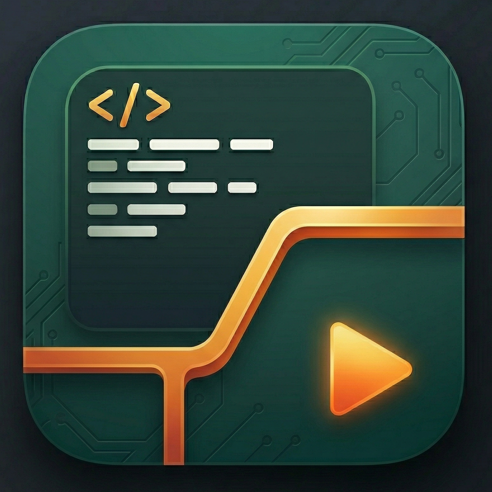

<p align="center">
  
</p>

<h1 align="center">Director's Cut</h1>
<p align="center"><strong>AI video editing from the command line.</strong></p>
<p align="center">
  Point it at a folder of raw footage, describe the video you want, and get a finished MP4 — with narration, subtitles, and transitions — in about two minutes.
</p>

<p align="center">
  <a href="#quick-start">Quick Start</a> &bull;
  <a href="#commands">Commands</a> &bull;
  <a href="#features">Features</a> &bull;
  <a href="#examples">Examples</a> &bull;
  <a href="#licensing">Licensing</a>
</p>

---

## Quick Start

### 1. Install

```bash
brew tap MatthewWaller/directorscut
brew install directorscut
```

### 2. Configure

```bash
# Interactive setup — walks you through API keys
directorscut setup
```

Or manually edit `~/.directorscut/.env`:

```bash
DIRECTORSCUT_GEMINI_API_KEY=your_gemini_key_here
DIRECTORSCUT_ELEVENLABS_API_KEY=your_elevenlabs_key_here   # optional
```

**Get API keys:**
- Gemini: https://aistudio.google.com/apikey (free tier available)
- ElevenLabs: https://elevenlabs.io/app/settings/api-keys (free tier available, optional — only needed for cloud narration)

### 3. Verify

```bash
directorscut doctor
```

### 4. Create your first video

```bash
directorscut edit \
  -p "Create a 30-second highlight reel" \
  -f ./my-footage/ \
  -o highlight.mp4
```

## Requirements

| Requirement | Notes |
|------------|-------|
| **macOS Apple Silicon** | M1, M2, M3, or M4 |
| **FFmpeg** | `brew install ffmpeg` |
| **Gemini API key** | Free tier available at [aistudio.google.com](https://aistudio.google.com/apikey) |
| ElevenLabs API key | Optional. For cloud narration. Free tier available |

## Commands

### `directorscut edit` — Create a video from prompt + footage

The main command. Analyzes your footage, generates AI edit decisions, and renders a finished video.

```bash
directorscut edit \
  -p "Create a 30-second product demo with upbeat narration" \
  -f ./raw-footage/ \
  -o demo.mp4
```

**Key flags:**

| Flag | Description |
|------|-------------|
| `-p, --prompt` | Natural language description of the video you want |
| `-f, --footage` | Folder containing raw video clips |
| `-o, --output` | Output video path |
| `--generate-narration` | Auto-generate AI voiceover |
| `--narration <path>` | Use an existing narration audio file |
| `-s, --subtitles <style>` | Add animated subtitles: `default`, `bold`, `minimal`, `tiktok` |
| `--aspect-ratio` | `16:9` (default), `9:16`, `1:1`, `4:5` |
| `--preview` | Low-res 480p preview for fast iteration |
| `--cache <path>` | Reuse analysis cache (skip re-analyzing footage) |
| `--edit-decision <path>` | Reuse saved edit decision JSON (skip AI call entirely) |
| `--export-otio <path>` | Also export OpenTimelineIO for Premiere/Resolve/FCP |
| `--tts <provider>` | TTS engine: `elevenlabs` or `local` |
| `-c, --context` | Project description to help the AI understand your footage |
| `--background` | Background fill: `blur` (default), `black`, `white` |
| `--background-image` | Custom background image for aspect-fit framing |
| `--title-card` | Add title card: `"text\|position\|duration[\|bg_hex[\|font_size]]"` |
| `--text` | Add text overlay: `"text\|start\|duration[\|position[\|font_size]]"` |

### `directorscut analyze` — Pre-analyze footage

Analyze clips once, then run multiple edits instantly using the cache.

```bash
# Analyze footage
directorscut analyze ./footage

# Force re-analysis
directorscut analyze ./footage --force

# Provide context to help the model
directorscut analyze ./footage -c "Footage of a cooking tutorial"
```

### `directorscut narrate` — Add voiceover to existing video

Generate AI narration for a video that already exists.

```bash
# Generate narration
directorscut narrate video.mp4 -p "Explain this process step by step"

# With subtitles
directorscut narrate video.mp4 -p "Tutorial walkthrough" -s tiktok

# Local TTS with voice cloning
directorscut narrate video.mp4 -p "Product demo" --tts local

# Just generate the script, don't synthesize audio
directorscut narrate video.mp4 -p "Quick overview" --script-only --script script.txt

# Generate audio but don't mux into the video
directorscut narrate video.mp4 -p "Walkthrough" --audio-only

# Custom voice and quieter original audio
directorscut narrate video.mp4 -p "Dramatic style" --voice "pNInz6obpgDQGcFmaJgB" --duck 0.1
```

**Key flags:**

| Flag | Description |
|------|-------------|
| `-p, --prompt` | Creative direction for the narration |
| `-o, --output` | Output path (default: `<video>_narrated.mp4`) |
| `--voice` | ElevenLabs voice ID |
| `--duck` | Volume for original audio during narration (0.0–1.0, default: 0.3) |
| `--script` | Save narration script to text file |
| `--script-only` | Generate script only, skip synthesis |
| `--audio-only` | Generate script + audio, skip video muxing |
| `-s, --subtitles` | Add subtitles: `default`, `bold`, `minimal`, `tiktok` |
| `--tts` | TTS provider: `elevenlabs` or `local` |

### `directorscut subtitle` — Add animated subtitles

Transcribe audio and burn in word-by-word animated subtitles.

```bash
# Auto-transcribe and subtitle
directorscut subtitle video.mp4

# TikTok-style
directorscut subtitle video.mp4 --style tiktok

# Use existing word timestamps (from narration)
directorscut subtitle video.mp4 --timestamps narration.words.json

# Just generate the .ass file, don't burn in
directorscut subtitle video.mp4 --subs-only
```

### `directorscut share-info` — Generate social media metadata

Analyze a video and generate titles, descriptions, and hashtags for publishing.

```bash
directorscut share-info video.mp4
directorscut share-info video.mp4 -i "Always include the URL https://mysite.com"
```

### `directorscut publish` — Upload to YouTube/TikTok

```bash
# Publish with auto-generated metadata
directorscut publish video.mp4 -p youtube --share-info share.json

# Publish to multiple platforms
directorscut publish video.mp4 -p youtube -p tiktok -t "My Video"

# Schedule for later
directorscut publish video.mp4 -p youtube -t "My Video" --schedule 2026-04-01T12:00:00Z
```

### `directorscut setup` — Interactive configuration

Walks you through setting API keys and preferences. Saves to `~/.directorscut/.env`.

### `directorscut doctor` — Health check

Validates your configuration: API keys, FFmpeg, and TTS availability.

### `directorscut inspect` — View analysis cache

```bash
directorscut inspect ./footage/analysis.db
```

### `directorscut activate` — Activate license key

```bash
directorscut activate YOUR_LICENSE_KEY
```

### `directorscut check-license` — View license status

### `directorscut deactivate-license` — Move license to another machine

---

## Features

### Prompt-driven editing

Describe the video you want in natural language. The AI analyzes your footage, selects the best clips, sequences them, adds transitions and text overlays, and renders the final output.

```bash
directorscut edit \
  -p "Create a 1-minute product walkthrough. Start with the end result for a hook, then show the process step by step." \
  -f ./footage \
  -o walkthrough.mp4
```

### AI narration with voice cloning

Auto-generate voiceover scripts timed to your video pacing. Use ElevenLabs for cloud TTS, or clone your own voice locally with Chatterbox — your voice data never leaves your machine.

```bash
# Cloud narration
directorscut edit -p "Product demo" -f ./footage -o demo.mp4 --generate-narration

# Local voice cloning (set DIRECTORSCUT_VOICE_REF in .env)
directorscut narrate video.mp4 -p "Tutorial walkthrough" --tts local
```

To configure voice cloning, add a 10–30 second reference audio clip to your config:

```bash
# In ~/.directorscut/.env
DIRECTORSCUT_VOICE_REF=/path/to/my-voice-sample.mp3
```

### Animated subtitles

TikTok-style word-by-word subtitles with precise timing. Four styles to match your content:

| Style | Best for |
|-------|----------|
| `default` | General use — Arial, yellow highlight |
| `bold` | Emphasis — Arial Black, larger text |
| `minimal` | Clean look — thin outline, orange highlight |
| `tiktok` | Social media — large text, red highlight, 3 words at a time |

### Transparent edit decisions

Every edit decision is saved as readable, editable JSON. You can inspect exactly what the AI chose, modify it by hand, and re-render without making another AI call:

```bash
# First run generates the edit decision
directorscut edit -p "Highlight reel" -f ./footage -o v1.mp4

# Edit the JSON to taste, then re-render instantly
directorscut edit -p "" -f ./footage -o v2.mp4 \
  --edit-decision v1_edit_decision.json
```

### Batch production

Run the same footage with different prompts to get different videos. Great for A/B testing content or producing variations at scale:

```bash
directorscut edit -p "30-second product demo" -f ./footage -o demo.mp4
directorscut edit -p "15-second TikTok hook" -f ./footage -o hook.mp4 --aspect-ratio 9:16
directorscut edit -p "Tutorial walkthrough" -f ./footage -o tutorial.mp4
```

### Multi-format output

- **Aspect ratios:** 16:9 (YouTube), 9:16 (TikTok/Reels/Shorts), 1:1 (Instagram), 4:5 (Facebook)
- **Background modes:** Blur, black, white, or custom image when source doesn't match output ratio
- **OTIO export:** Hand off rough cuts to Premiere Pro, DaVinci Resolve, or Final Cut Pro

### Cloud analysis with optional local TTS

| Component | Provider | Requirements |
|-----------|----------|-------------|
| **Analysis** | Gemini | Gemini API key |
| **Edit Decisions** | Gemini | Gemini API key |
| **TTS (cloud)** | ElevenLabs | ElevenLabs API key |
| **TTS (local)** | Chatterbox | Apple Silicon Mac |

```bash
# Cloud narration (ElevenLabs)
directorscut edit -p "Highlight reel" -f ./footage -o video.mp4 \
  --generate-narration

# Local narration (Chatterbox — your voice never leaves your machine)
directorscut edit -p "Highlight reel" -f ./footage -o video.mp4 \
  --generate-narration --tts local
```

### Direct publishing

Upload directly to YouTube and TikTok with auto-generated titles, descriptions, and hashtags.

---

## Examples

### Product demo with narration and subtitles

```bash
directorscut edit \
  -p "Create a 30-second product demo showing the scanning workflow" \
  -f ./raw-footage/product-shots/ \
  -o demo.mp4 \
  --generate-narration \
  --subtitles tiktok \
  --aspect-ratio 16:9
```

### Vertical video for TikTok

```bash
directorscut edit \
  -p "15-second hook — start with the most impressive result, then show the quick process" \
  -f ./footage/ \
  -o tiktok-hook.mp4 \
  --aspect-ratio 9:16 \
  --generate-narration \
  -s tiktok
```

### Title cards and text overlays

```bash
directorscut edit \
  -p "Walkthrough video with chapter breaks" \
  -f ./footage/ \
  -o walkthrough.mp4 \
  --title-card "Chapter 1: Getting Started|0|3|#1a1a2e|64" \
  --title-card "Chapter 2: Advanced Features|2|3|#1a1a2e|64" \
  --text "Available now|25|4|bottom|48"
```

### Analyze once, edit many times

```bash
# Analyze footage (cached in SQLite)
directorscut analyze ./footage

# Now edits are instant — no re-analysis needed
directorscut edit -p "Highlight reel" -f ./footage -o v1.mp4 --cache ./footage/analysis.db
directorscut edit -p "Tutorial" -f ./footage -o v2.mp4 --cache ./footage/analysis.db
directorscut edit -p "Social clip" -f ./footage -o v3.mp4 --cache ./footage/analysis.db --aspect-ratio 9:16
```

### Export to professional NLE

```bash
directorscut edit \
  -p "Rough cut of the interview" \
  -f ./footage/ \
  -o rough-cut.mp4 \
  --export-otio timeline.otio
```

Open `timeline.otio` in Premiere Pro, DaVinci Resolve, or Final Cut Pro for final polish.

---

## Configuration

All configuration lives in `~/.directorscut/.env`. You can also place a `.env` file in your project directory — local settings override global ones.

| Variable | Default | Description |
|----------|---------|-------------|
| `DIRECTORSCUT_GEMINI_API_KEY` | — | Google Gemini API key |
| `DIRECTORSCUT_ELEVENLABS_API_KEY` | — | ElevenLabs TTS API key |
| `DIRECTORSCUT_TTS_PROVIDER` | `elevenlabs` | TTS engine: `elevenlabs` or `local` |
| `DIRECTORSCUT_DEFAULT_ASPECT_RATIO` | `16:9` | Default output aspect ratio |
| `DIRECTORSCUT_VOICE_REF` | — | Path to voice cloning reference audio (10–30s clip) |
| `DIRECTORSCUT_WHISPER_MODEL` | `base` | Whisper model: `tiny`, `base`, `small`, `medium`, `large-v3` |
| `DIRECTORSCUT_ELEVENLABS_VOICE_ID` | — | Default ElevenLabs voice ID |
| `DIRECTORSCUT_LICENSE_KEY` | — | License key from Polar |

### Providing context

The AI can only see what's in the video frames. Providing context about your project and individual clips dramatically improves analysis quality.

**Project-level context** — place a `context.txt` in your footage folder (auto-detected by `analyze` and `edit`):

```
footage/
  context.txt              <-- "This is footage of a 3D scanning app called Sapling..."
  clip_01.mp4
  clip_02.mp4
```

Or pass it directly: `--context "Footage of a cooking tutorial"`

**Per-clip context** — create a `.txt` sidecar file with the same name as each video. This is useful for details the AI can't infer from visuals alone — product names, off-screen context, or what a UI element does:

```
footage/
  context.txt                      <-- project-level context
  elephant_scan.mp4
  elephant_scan.mp4.txt            <-- "Shows the 3D model alongside the original figurine"
  robot_panda.mp4
  robot_panda.mp4.txt              <-- "The image-to-3D robotic panda is compared in AR to a toy"
```

Both levels are combined during analysis — project context gives the big picture, per-clip context fills in specifics.

---

## Output Files

A typical edit run produces:

```
output/
  video.mp4                          # Rendered video
  video_edit_decision.json           # AI edit decisions (reusable, editable)
  video_narration.txt                # Narration script
  video_narration.mp3                # Narration audio
  video_narration.words.json         # Word-level timestamps
  video_narrated.mp4                 # Video + narration
  video_subtitles.ass                # Subtitle file
  video_narrated_subtitled.mp4       # Final video with everything
```

---

## How It Works

```
Footage Folder ──> Analyze ──> Edit Decisions ──> Render ──> Output
                     |              |                |
                 Scene detect   LLM chooses      MoviePy
                 VLM describe   clips, order,    assembles
                 Transcribe     transitions,     timeline
                 Cache to DB    text overlays    + effects
```

1. **Analysis** — Each clip is analyzed for scenes, visual content, and speech. Results are cached in SQLite so subsequent edits with different prompts are instant.
2. **Edit decisions** — An LLM receives the analyses and your prompt, then outputs structured JSON: which clips to use, start/end times, ordering, transitions, title cards, and narration text.
3. **Rendering** — MoviePy assembles the timeline with aspect-ratio-aware framing, transitions, text overlays, and effects.
4. **Post-processing** — Optional narration (AI writes a script matched to video pacing, then synthesizes via TTS), subtitles (word-level animation), and direct publishing.

---

## Samples

The `samples/full_walkthrough/` directory contains a complete example:

- `demo_walkthrough.mp4` — Finished video with narration and TikTok-style subtitles
- `full_walkthrough_edit_decision.json` — The AI's edit decisions (inspect and learn the format)
- `full_walkthrough_narration.txt` — Generated narration script
- `full_walkthrough_subtitles.ass` — Generated subtitle file

---

## Licensing

Director's Cut includes **3 free video generations** so you can try it out.

After that, purchase a license key for unlimited use:

**[Get a License Key — $29 one-time](https://buy.polar.sh/polar_cl_c3DqnSEinyIb7eELj9SzjxDnRfig6TOzfpc6W48Ks04)**

- One-time purchase — no subscription, no per-minute pricing
- All future updates included
- License is tied to your machine (deactivate and reactivate to move it)

```bash
# Activate your license
directorscut activate YOUR_LICENSE_KEY

# Check status
directorscut check-license

# Move to another machine
directorscut deactivate-license
```

---

## Support

- Issues: Open a GitHub issue on this repository
- Email: support@madscientistslab.com

---

<p align="center">
  Made by <a href="https://cephalopodstudio.com">Cephalopod Studio</a>
</p>
